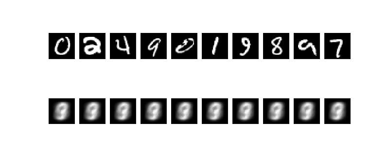
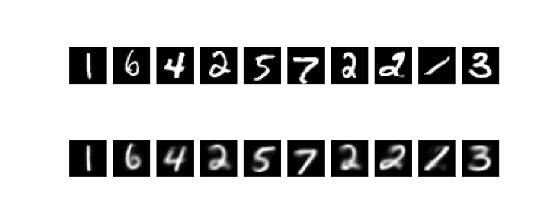
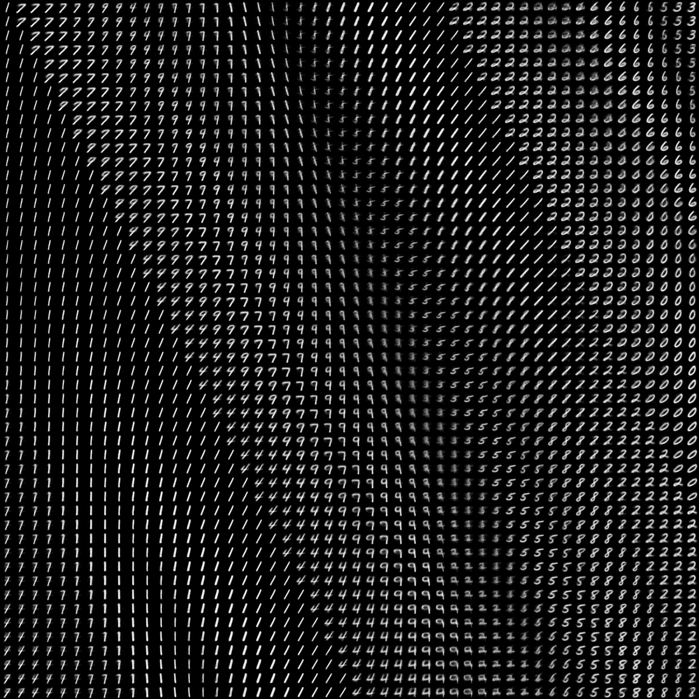

# Low-Dimensional-Autoencoder (Keras)

There is a problem with autoencoders - it's pretty hard to encode high-dimensional data into meaningful low-dimensional representation of that data. What even more disappointing that if you even try to do that, it will stuck at some loss after couple of steps and will not produce any better results no matter how long you will train it.

This is a typical result that you gets if you try to encode MNIST into 2D latent space
  
And that's what's LDA method gets for exactly the same model and latent space dimension
  
Not perfect of course, but much better  
  
  
The way as I solve the problem is by fitting autoencoder along with encoder that trains on a set of representation of how we want to see latent space. More exactly, it sets a random point for each datapoint at first and than after each step its stretch latent space the way so it touches the boundaries. It's also pushing datapoints out of each other, so they not stuck together. This step might not be so helpful for big and consistency dataset like MNIST, but will be extremely useful for small and low density datasets were some points much different from others.

And ofcourse it's work even better with more dimensions, so it's also more efficient way to dimensionality reduction

#### Example of 2D latent space for MNIST

  
